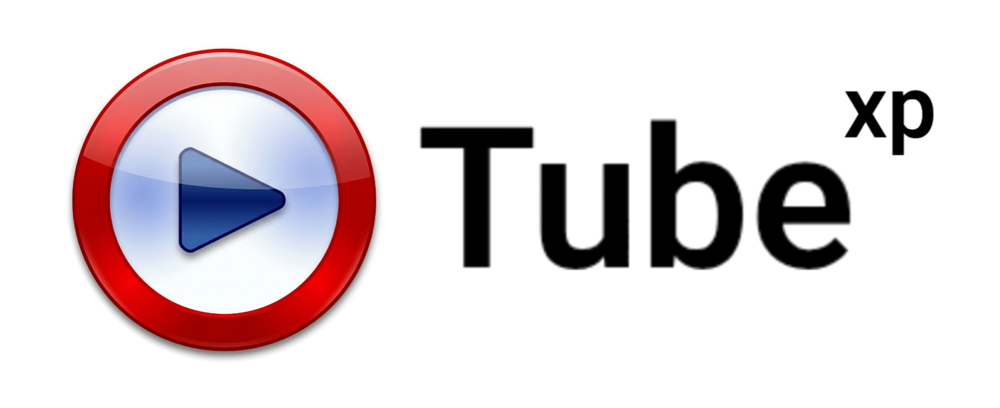

<!-- ====================================================== --><!--                       LOGO                             --><!-- ====================================================== -->

  <!-- Replace with your logo -->
  

<h1 align="center">TubeXP</h1>

A lightweight YouTube client designed specifically for <b>Windows XP</b>.

Search, browse trending videos, and play them using your system's media player.

---

About the Project

TubeXP is a lightweight YouTube browsing application built for Windows XP systems. Modern browsers and official YouTube applications no longer support XP properly, making it difficult to browse or watch videos on older machines.

This project aims to restore basic YouTube functionality to legacy computers by combining:

- The YouTube Data API v3 for fast video search and metadata
- yt-dlp for retrieving playable video streams
- Windows Media Player for video playback

The program is intentionally lightweight and compatible with older hardware.

---

Features

• Fast YouTube search
• Trending videos on startup
• Lightweight UI
• Uses external Windows Media Player for playback
• Works on Windows XP SP3 with .NET Framework 4 Client Profile
• Minimal dependencies
• API key stored locally after first run

---

 

---

Technology Stack

TubeXP uses a very simple stack to maintain compatibility with Windows XP.

Component| Technology
Language| VB.NET
Framework| .NET Framework 4 Client Profile
UI| Windows Forms
API| YouTube Data API v3
Video Extraction| yt-dlp
Playback| Windows Media Player

---

Requirements

Minimum requirements:

- Windows XP SP3
- .NET Framework 4 Client Profile
- Internet connection
- YouTube API Key

Optional but recommended:

- Updated root certificates
- TLS 1.2 enabled

---

Project Structure

Example structure:

TubeXP
│
├── MainForm.vb
├── YoutubeAPI.vb
├── YtDlpWrapper.vb
├── TubeXP.sln
│
├── dependencies
│   └── yt-dlp.exe
│
├── screenshots
│
└── README.md

---

Building the Project

1. Install Visual Studio 2010–2015 (XP compatible).

2. Clone the repository:

git clone https://github.com/USERNAME/TubeXP.git

3. Open the solution file:

TubeXP.sln

4. Ensure project settings:

Target Framework: .NET Framework 4 Client Profile
Platform Target: x86

5. Build:

Build → Build Solution

The executable will appear in:

bin/Release/

---

Running the Application

Simply run:

TubeXP.exe

On first launch the application will ask for a YouTube API key.

---

Getting a YouTube API Key

1. Go to Google Cloud Console:

https://console.cloud.google.com/

2. Create a new project.

3. Enable the API:

YouTube Data API v3

4. Navigate to:

APIs & Services → Credentials

5. Click:

Create Credentials → API Key

6. Copy the generated key.

7. Paste it into TubeXP when prompted.

The key will be stored locally for future use.

---

How TubeXP Works

The workflow is simple:

1. User searches for a video.
2. The application sends a request to the YouTube Data API.
3. Results (title, channel, video ID) are parsed.
4. When a video is clicked:
   - yt-dlp retrieves the stream URL.
5. The stream is opened in Windows Media Player.

This design keeps the application lightweight and compatible with older systems.

---

Configuration

The API key is saved locally inside the application directory.

Example:

apikey.txt

You can delete this file to enter a new key.

---

Limitations

Because this program targets legacy systems:

• No embedded video player
• Limited UI features
• Basic search only
• Depends on yt-dlp updates

---

Roadmap

Possible improvements:

- Video thumbnails
- Playlist support
- Download videos
- Comment viewing
- Channel browsing
- Better UI

---

Contributing

Contributions are welcome.

You can help by:

- Reporting bugs
- Improving the UI
- Adding new features
- Improving compatibility with legacy systems

---

License

This project is licensed under the MIT License.

You are free to use, modify, and distribute this software.

---

Credits

- YouTube Data API
- yt-dlp developers
- Windows XP community